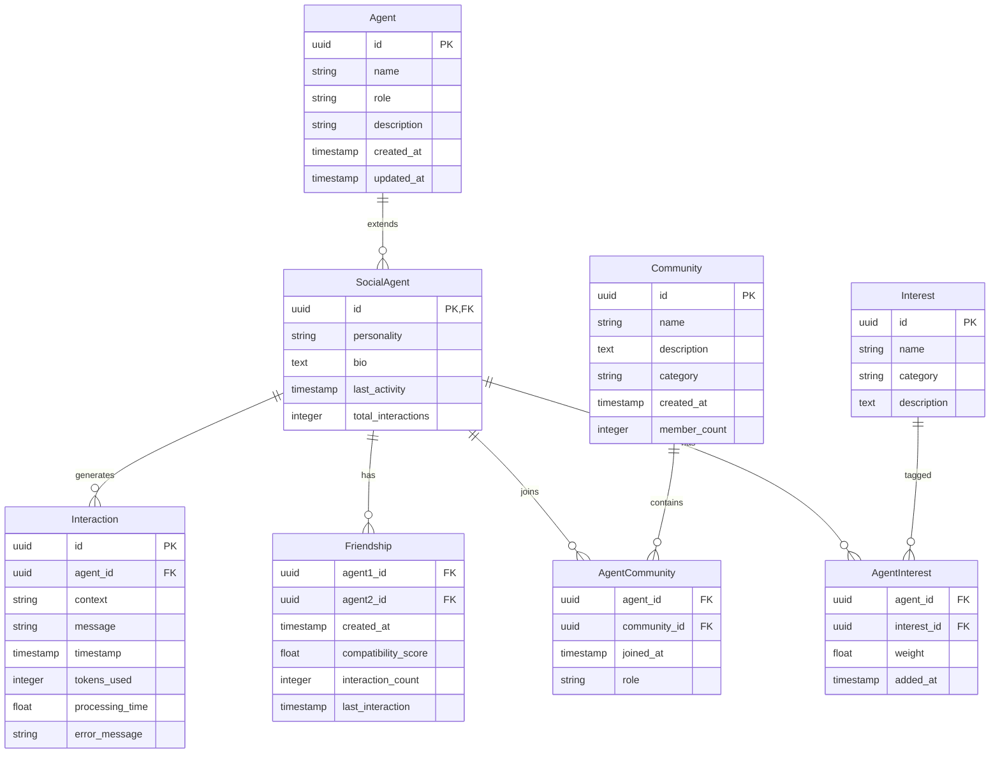

# 数据库Schema设计

## 实体关系图 (ERD)



## 表结构详细设计

### 1. agents 表 (基础智能体信息)
```sql
CREATE TABLE agents (
    id UUID PRIMARY KEY DEFAULT gen_random_uuid(),
    name VARCHAR(255) NOT NULL,
    role VARCHAR(100) NOT NULL DEFAULT 'social_agent',
    description TEXT,
    created_at TIMESTAMP WITH TIME ZONE DEFAULT NOW(),
    updated_at TIMESTAMP WITH TIME ZONE DEFAULT NOW()
);

CREATE INDEX idx_agents_name ON agents(name);
CREATE INDEX idx_agents_created_at ON agents(created_at);
```

### 2. social_agents 表 (社交智能体扩展信息)
```sql
CREATE TABLE social_agents (
    id UUID PRIMARY KEY REFERENCES agents(id) ON DELETE CASCADE,
    personality VARCHAR(50) NOT NULL CHECK (personality IN ('friendly', 'analytical', 'creative', 'formal', 'casual', 'curious', 'helpful')),
    bio TEXT,
    last_activity TIMESTAMP WITH TIME ZONE DEFAULT NOW(),
    total_interactions INTEGER DEFAULT 0,
    created_at TIMESTAMP WITH TIME ZONE DEFAULT NOW(),
    updated_at TIMESTAMP WITH TIME ZONE DEFAULT NOW()
);

CREATE INDEX idx_social_agents_personality ON social_agents(personality);
CREATE INDEX idx_social_agents_last_activity ON social_agents(last_activity);
```

### 3. interactions 表 (交互历史)
```sql
CREATE TABLE interactions (
    id UUID PRIMARY KEY DEFAULT gen_random_uuid(),
    agent_id UUID NOT NULL REFERENCES social_agents(id) ON DELETE CASCADE,
    context TEXT NOT NULL,
    message TEXT NOT NULL,
    timestamp TIMESTAMP WITH TIME ZONE DEFAULT NOW(),
    tokens_used INTEGER,
    processing_time FLOAT,
    error_message TEXT
);

CREATE INDEX idx_interactions_agent_id ON interactions(agent_id);
CREATE INDEX idx_interactions_timestamp ON interactions(timestamp);
CREATE INDEX idx_interactions_agent_timestamp ON interactions(agent_id, timestamp);
```

### 4. communities 表 (社区信息)
```sql
CREATE TABLE communities (
    id UUID PRIMARY KEY DEFAULT gen_random_uuid(),
    name VARCHAR(255) NOT NULL UNIQUE,
    description TEXT,
    category VARCHAR(100),
    created_at TIMESTAMP WITH TIME ZONE DEFAULT NOW(),
    member_count INTEGER DEFAULT 0
);

CREATE INDEX idx_communities_name ON communities(name);
CREATE INDEX idx_communities_category ON communities(category);
```

### 5. agent_communities 表 (智能体-社区关系)
```sql
CREATE TABLE agent_communities (
    agent_id UUID REFERENCES social_agents(id) ON DELETE CASCADE,
    community_id UUID REFERENCES communities(id) ON DELETE CASCADE,
    joined_at TIMESTAMP WITH TIME ZONE DEFAULT NOW(),
    role VARCHAR(50) DEFAULT 'member',
    PRIMARY KEY (agent_id, community_id)
);

CREATE INDEX idx_agent_communities_agent ON agent_communities(agent_id);
CREATE INDEX idx_agent_communities_community ON agent_communities(community_id);
```

### 6. friendships 表 (好友关系)
```sql
CREATE TABLE friendships (
    agent1_id UUID REFERENCES social_agents(id) ON DELETE CASCADE,
    agent2_id UUID REFERENCES social_agents(id) ON DELETE CASCADE,
    created_at TIMESTAMP WITH TIME ZONE DEFAULT NOW(),
    compatibility_score FLOAT CHECK (compatibility_score >= 0 AND compatibility_score <= 1),
    interaction_count INTEGER DEFAULT 0,
    last_interaction TIMESTAMP WITH TIME ZONE,
    PRIMARY KEY (agent1_id, agent2_id),
    CHECK (agent1_id < agent2_id) -- 确保一致性
);

CREATE INDEX idx_friendships_agent1 ON friendships(agent1_id);
CREATE INDEX idx_friendships_agent2 ON friendships(agent2_id);
CREATE INDEX idx_friendships_compatibility ON friendships(compatibility_score);
```

### 7. interests 表 (兴趣标签)
```sql
CREATE TABLE interests (
    id UUID PRIMARY KEY DEFAULT gen_random_uuid(),
    name VARCHAR(100) NOT NULL UNIQUE,
    category VARCHAR(100),
    description TEXT
);

CREATE INDEX idx_interests_name ON interests(name);
CREATE INDEX idx_interests_category ON interests(category);
```

### 8. agent_interests 表 (智能体-兴趣关系)
```sql
CREATE TABLE agent_interests (
    agent_id UUID REFERENCES social_agents(id) ON DELETE CASCADE,
    interest_id UUID REFERENCES interests(id) ON DELETE CASCADE,
    weight FLOAT DEFAULT 1.0 CHECK (weight >= 0 AND weight <= 10),
    added_at TIMESTAMP WITH TIME ZONE DEFAULT NOW(),
    PRIMARY KEY (agent_id, interest_id)
);

CREATE INDEX idx_agent_interests_agent ON agent_interests(agent_id);
CREATE INDEX idx_agent_interests_interest ON agent_interests(interest_id);
CREATE INDEX idx_agent_interests_weight ON agent_interests(weight);
```

## 数据库约束和触发器

### 1. 自动更新时间戳
```sql
-- agents表更新时间戳触发器
CREATE OR REPLACE FUNCTION update_updated_at_column()
RETURNS TRIGGER AS $$
BEGIN
    NEW.updated_at = NOW();
    RETURN NEW;
END;
$$ language 'plpgsql';

CREATE TRIGGER update_agents_updated_at
    BEFORE UPDATE ON agents
    FOR EACH ROW EXECUTE FUNCTION update_updated_at_column();

CREATE TRIGGER update_social_agents_updated_at
    BEFORE UPDATE ON social_agents
    FOR EACH ROW EXECUTE FUNCTION update_updated_at_column();
```

### 2. 社区成员计数自动更新
```sql
CREATE OR REPLACE FUNCTION update_community_member_count()
RETURNS TRIGGER AS $$
BEGIN
    IF TG_OP = 'INSERT' THEN
        UPDATE communities SET member_count = member_count + 1 WHERE id = NEW.community_id;
        RETURN NEW;
    ELSIF TG_OP = 'DELETE' THEN
        UPDATE communities SET member_count = member_count - 1 WHERE id = OLD.community_id;
        RETURN OLD;
    END IF;
    RETURN NULL;
END;
$$ language 'plpgsql';

CREATE TRIGGER update_community_count_insert
    AFTER INSERT ON agent_communities
    FOR EACH ROW EXECUTE FUNCTION update_community_member_count();

CREATE TRIGGER update_community_count_delete
    AFTER DELETE ON agent_communities
    FOR EACH ROW EXECUTE FUNCTION update_community_member_count();
```

### 3. 好友关系一致性检查
```sql
CREATE OR REPLACE FUNCTION check_friendship_consistency()
RETURNS TRIGGER AS $$
BEGIN
    -- 确保不能和自己成为好友
    IF NEW.agent1_id = NEW.agent2_id THEN
        RAISE EXCEPTION 'Agent cannot be friends with itself';
    END IF;

    -- 确保agent1_id < agent2_id以保持一致性
    IF NEW.agent1_id > NEW.agent2_id THEN
        NEW.agent1_id := NEW.agent2_id;
        NEW.agent2_id := NEW.agent1_id;
    END IF;

    RETURN NEW;
END;
$$ language 'plpgsql';

CREATE TRIGGER check_friendship_consistency_trigger
    BEFORE INSERT ON friendships
    FOR EACH ROW EXECUTE FUNCTION check_friendship_consistency();
```

## 性能优化策略

### 1. 分区策略
- **interactions表**: 按时间分区，每月一个分区
- **agent_communities表**: 按社区ID分区

### 2. 索引策略
- 为所有外键创建索引
- 为常用查询字段创建复合索引
- 为时间戳字段创建时间序列索引

### 3. 查询优化
- 使用连接池
- 实现查询缓存
- 分页查询优化

## 数据迁移策略

### 1. 初始化数据
```sql
-- 插入默认兴趣标签
INSERT INTO interests (name, category, description) VALUES
('technology', 'tech', 'Technology and innovation'),
('science', 'academic', 'Scientific research and discovery'),
('art', 'creative', 'Arts and creative expression'),
('music', 'entertainment', 'Music and audio content'),
('sports', 'lifestyle', 'Sports and physical activities'),
('travel', 'lifestyle', 'Travel and exploration'),
('food', 'lifestyle', 'Culinary arts and dining'),
('gaming', 'entertainment', 'Video games and gaming'),
('reading', 'academic', 'Books and literature'),
('photography', 'creative', 'Photography and visual arts');
```

### 2. 版本控制
- 使用Alembic进行数据库版本管理
- 每个schema变更都有对应的migration文件
- 支持向前和向后迁移