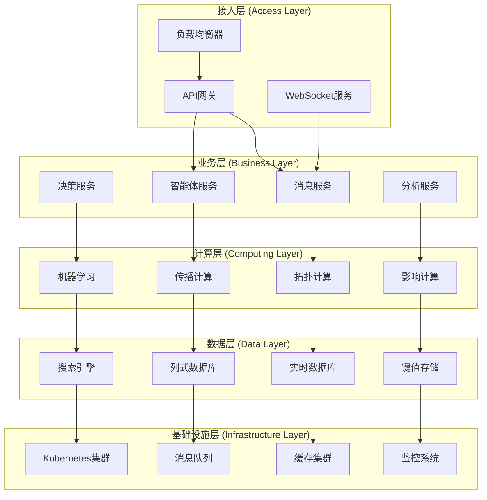
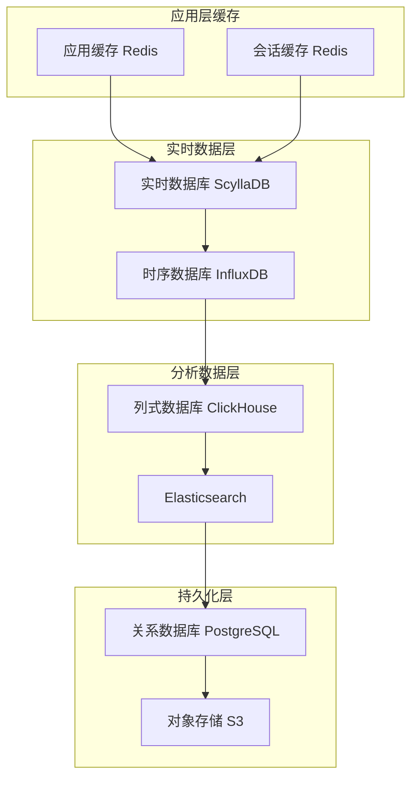
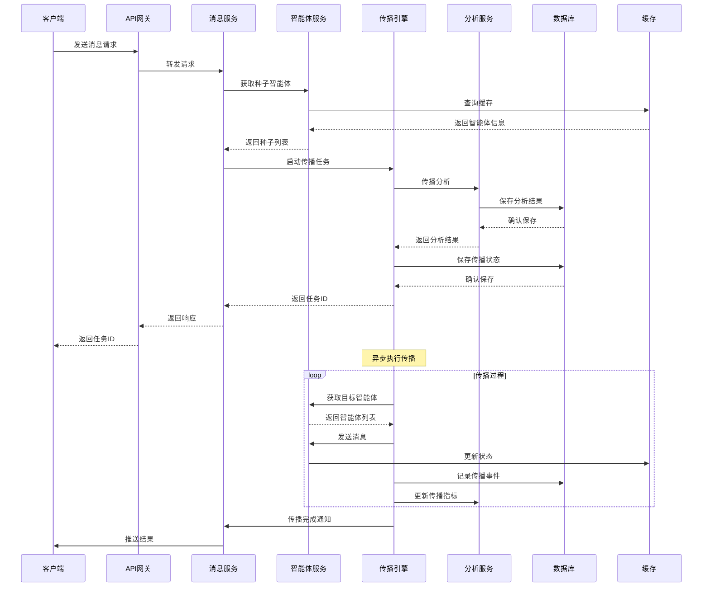

# 百万级智能体消息传播系统架构

## 目录
1. [系统概述](#系统概述)
2. [整体架构设计](#整体架构设计)
3. [核心组件详解](#核心组件详解)
4. [数据存储设计](#数据存储设计)
5. [消息处理流程](#消息处理流程)
6. [扩展性设计](#扩展性设计)
7. [监控和运维](#监控和运维)

## 系统概述

### 系统目标
构建一个能够支持百万级智能体实时消息传播的高性能、高可用系统，实现：
- **海量并发**: 支持百万智能体同时在线
- **实时传播**: 消息传播延迟在毫秒级
- **智能决策**: 基于传播模型的智能决策
- **弹性扩展**: 支持水平扩展
- **容错能力**: 单点故障不影响整体系统

### 核心挑战
1. **规模挑战**: 百万级节点的网络计算
2. **性能挑战**: 实时性要求与计算复杂度的平衡
3. **一致性挑战**: 分布式环境下的数据一致性
4. **可靠性挑战**: 系统高可用和故障恢复
5. **成本挑战**: 计算和存储成本控制

### 技术选型原则
- **成熟稳定**: 选择经过大规模验证的技术
- **性能优先**: 优先考虑性能和扩展性
- **生态完善**: 考虑技术栈的完整性和社区支持
- **易于维护**: 降低运维复杂度

## 整体架构设计

### 分层架构



### 微服务架构

#### 服务拆分原则
1. **业务边界**: 按业务功能拆分
2. **数据独立**: 每个服务独立的数据存储
3. **部署独立**: 可以独立部署和扩展
4. **故障隔离**: 单个服务故障不影响其他服务

#### 核心服务模块

```python
# 消息传播服务
class MessagePropagationService:
    def __init__(self):
        self.network_service = NetworkService()
        self.influence_service = InfluenceService()
        self.tracker_service = TrackerService()

    async def propagate_message(self, message: Message, seeds: List[str]):
        """消息传播主入口"""
        # 1. 验证输入
        await self._validate_inputs(message, seeds)

        # 2. 计算传播路径
        propagation_plan = await self._calculate_propagation_plan(
            message, seeds
        )

        # 3. 执行传播
        results = await self._execute_propagation(propagation_plan)

        # 4. 记录追踪信息
        await self.tracker_service.track_propagation(results)

        return results

# 智能体管理服务
class AgentService:
    def __init__(self):
        self.agent_repository = AgentRepository()
        self.relationship_service = RelationshipService()
        self.behavior_service = BehaviorService()

    async def create_agent(self, agent_config: AgentConfig):
        """创建智能体"""
        agent = Agent.from_config(agent_config)
        await self.agent_repository.save(agent)
        await self.relationship_service.initialize_relationships(agent)
        return agent

    async def update_agent_state(self, agent_id: str, state: AgentState):
        """更新智能体状态"""
        agent = await self.agent_repository.get(agent_id)
        agent.update_state(state)
        await self.agent_repository.save(agent)

        # 触发相关事件
        await self.behavior_service.process_state_change(agent)

# 网络分析服务
class NetworkAnalysisService:
    def __init__(self):
        self.graph_processor = GraphProcessor()
        self.metrics_calculator = MetricsCalculator()

    async def analyze_network_structure(self, network_id: str):
        """分析网络结构"""
        network = await self._load_network(network_id)

        # 计算网络指标
        metrics = await self.metrics_calculator.calculate_all_metrics(network)

        # 识别关键节点
        influential_nodes = await self._identify_influential_nodes(network)

        # 分析社区结构
        communities = await self._detect_communities(network)

        return {
            'metrics': metrics,
            'influential_nodes': influential_nodes,
            'communities': communities
        }
```

### 事件驱动架构

#### 事件流设计
```python
from enum import Enum
from dataclasses import dataclass
from typing import Any, Dict

class EventType(Enum):
    AGENT_CREATED = "agent_created"
    AGENT_UPDATED = "agent_updated"
    MESSAGE_SENT = "message_sent"
    MESSAGE_RECEIVED = "message_received"
    PROPAGATION_STARTED = "propagation_started"
    PROPAGATION_COMPLETED = "propagation_completed"
    INFLUENCE_CALCULATED = "influence_calculated"

@dataclass
class Event:
    event_id: str
    event_type: EventType
    timestamp: datetime
    source_service: str
    data: Dict[str, Any]
    correlation_id: str = None

class EventBus:
    def __init__(self):
        self.handlers = defaultdict(list)
        self.middleware = []

    async def publish(self, event: Event):
        """发布事件"""
        # 执行中间件
        for middleware in self.middleware:
            event = await middleware.process(event)

        # 分发到处理器
        handlers = self.handlers[event.event_type]
        await asyncio.gather(*[
            handler.handle(event) for handler in handlers
        ])

    def subscribe(self, event_type: EventType, handler: EventHandler):
        """订阅事件"""
        self.handlers[event_type].append(handler)

# 事件处理器示例
class PropagationEventHandler:
    async def handle(self, event: Event):
        if event.event_type == EventType.MESSAGE_SENT:
            await self._handle_message_sent(event)
        elif event.event_type == EventType.PROPAGATION_COMPLETED:
            await self._handle_propagation_completed(event)

    async def _handle_message_sent(self, event: Event):
        """处理消息发送事件"""
        message_data = event.data
        # 启动传播分析
        await self._start_propagation_analysis(message_data)

    async def _handle_propagation_completed(self, event: Event):
        """处理传播完成事件"""
        propagation_data = event.data
        # 更新统计数据
        await self._update_statistics(propagation_data)
        # 通知相关服务
        await self._notify_interested_services(propagation_data)
```

## 核心组件详解

### 消息传播引擎

#### 传播引擎架构
```python
class PropagationEngine:
    def __init__(self):
        self.models = {
            'viral': ViralPropagationModel(),
            'diffusion': InformationDiffusionModel(),
            'hybrid': HybridPropagationModel()
        }
        self.scheduler = PropagationScheduler()
        self.executor = PropagationExecutor()

    async def start_propagation(self, request: PropagationRequest):
        """启动消息传播"""
        # 1. 选择传播模型
        model = self._select_model(request.model_type)

        # 2. 准备传播环境
        environment = await self._prepare_environment(request)

        # 3. 创建传播任务
        task = PropagationTask(
            request_id=request.request_id,
            model=model,
            environment=environment,
            config=request.config
        )

        # 4. 提交到调度器
        await self.scheduler.submit(task)

        return task.task_id

class PropagationScheduler:
    def __init__(self):
        self.task_queue = asyncio.Queue()
        self.running_tasks = {}
        self.max_concurrent = 1000

    async def submit(self, task: PropagationTask):
        """提交传播任务"""
        await self.task_queue.put(task)
        await self._process_queue()

    async def _process_queue(self):
        """处理任务队列"""
        while len(self.running_tasks) < self.max_concurrent and not self.task_queue.empty():
            task = await self.task_queue.get()

            # 创建任务协程
            task_coroutine = self._execute_task(task)

            # 添加到运行任务
            self.running_tasks[task.task_id] = task_coroutine

            # 启动任务
            asyncio.create_task(self._run_task(task))

    async def _run_task(self, task: PropagationTask):
        """运行传播任务"""
        try:
            executor = PropagationExecutor()
            result = await executor.execute(task)

            # 处理结果
            await self._handle_task_result(task, result)

        except Exception as e:
            # 处理异常
            await self._handle_task_error(task, e)

        finally:
            # 清理任务
            self.running_tasks.pop(task.task_id, None)
```

#### 批量处理优化
```python
class BatchPropagationProcessor:
    def __init__(self, batch_size: int = 1000):
        self.batch_size = batch_size
        self.pending_tasks = []
        self.processing_timer = None

    async def add_task(self, task: PropagationTask):
        """添加传播任务"""
        self.pending_tasks.append(task)

        # 检查是否需要立即处理
        if len(self.pending_tasks) >= self.batch_size:
            await self._process_batch()
        elif self.processing_timer is None:
            # 设置延迟处理
            self.processing_timer = asyncio.create_task(
                self._delayed_processing()
            )

    async def _process_batch(self):
        """处理批量任务"""
        if not self.pending_tasks:
            return

        batch = self.pending_tasks.copy()
        self.pending_tasks.clear()

        # 取消延迟处理
        if self.processing_timer:
            self.processing_timer.cancel()
            self.processing_timer = None

        # 按模型类型分组
        grouped_tasks = self._group_tasks_by_model(batch)

        # 并行处理不同组
        await asyncio.gather(*[
            self._process_task_group(model_type, tasks)
            for model_type, tasks in grouped_tasks.items()
        ])

    def _group_tasks_by_model(self, tasks: List[PropagationTask]):
        """按模型类型分组任务"""
        groups = defaultdict(list)
        for task in tasks:
            groups[task.model_type].append(task)
        return dict(groups)

    async def _process_task_group(self, model_type: str, tasks: List[PropagationTask]):
        """处理同类型任务组"""
        # 合并相似的网络计算
        optimized_tasks = await self._optimize_tasks(tasks)

        # 并行执行优化后的任务
        await asyncio.gather(*[
            self._execute_single_task(task) for task in optimized_tasks
        ])
```

### 智能体管理系统

#### 智能体生命周期管理
```python
class AgentLifecycleManager:
    def __init__(self):
        self.agent_registry = AgentRegistry()
        self.state_manager = AgentStateManager()
        self.behavior_engine = BehaviorEngine()

    async def create_agent(self, config: AgentConfig):
        """创建智能体"""
        # 1. 创建智能体实例
        agent = Agent.create(config)

        # 2. 注册智能体
        await self.agent_registry.register(agent)

        # 3. 初始化状态
        await self.state_manager.initialize_state(agent)

        # 4. 启动行为引擎
        await self.behavior_engine.start_agent_behavior(agent)

        # 5. 发布创建事件
        await self._publish_agent_created_event(agent)

        return agent

    async def activate_agent(self, agent_id: str):
        """激活智能体"""
        agent = await self.agent_registry.get(agent_id)

        # 更新状态
        await self.state_manager.set_active(agent)

        # 恢复行为引擎
        await self.behavior_engine.resume_agent_behavior(agent)

        # 重新建立网络连接
        await self._reestablish_connections(agent)

    async def deactivate_agent(self, agent_id: str):
        """停用智能体"""
        agent = await self.agent_registry.get(agent_id)

        # 暂停行为引擎
        await self.behavior_engine.pause_agent_behavior(agent)

        # 更新状态
        await self.state_manager.set_inactive(agent)

        # 保存当前状态
        await self.state_manager.save_state(agent)

    async def destroy_agent(self, agent_id: str):
        """销毁智能体"""
        agent = await self.agent_registry.get(agent_id)

        # 停止行为引擎
        await self.behavior_engine.stop_agent_behavior(agent)

        # 清理网络连接
        await self._cleanup_connections(agent)

        # 注销智能体
        await self.agent_registry.unregister(agent_id)

        # 发布销毁事件
        await self._publish_agent_destroyed_event(agent)
```

#### 状态管理
```python
class AgentStateManager:
    def __init__(self):
        self.state_store = StateStore()
        self.state_cache = StateCache()
        self.event_publisher = EventPublisher()

    async def update_state(self, agent_id: str, new_state: AgentState):
        """更新智能体状态"""
        # 1. 获取当前状态
        current_state = await self._get_current_state(agent_id)

        # 2. 验证状态转换
        if not self._is_valid_transition(current_state, new_state):
            raise InvalidStateTransitionError(
                f"Invalid transition from {current_state} to {new_state}"
            )

        # 3. 更新状态存储
        await self.state_store.update_state(agent_id, new_state)

        # 4. 更新缓存
        await self.state_cache.update(agent_id, new_state)

        # 5. 发布状态变更事件
        await self._publish_state_change_event(agent_id, current_state, new_state)

        # 6. 触发相关行为
        await self._trigger_state_change_behaviors(agent_id, new_state)

    async def get_state_history(self, agent_id: str, time_range: TimeRange):
        """获取状态历史"""
        return await self.state_store.get_state_history(agent_id, time_range)

    async def batch_update_states(self, state_updates: List[StateUpdate]):
        """批量更新状态"""
        # 验证所有状态转换
        for update in state_updates:
            current_state = await self._get_current_state(update.agent_id)
            if not self._is_valid_transition(current_state, update.new_state):
                raise InvalidStateTransitionError(
                    f"Invalid transition for agent {update.agent_id}"
                )

        # 批量更新存储
        await self.state_store.batch_update_states(state_updates)

        # 批量更新缓存
        for update in state_updates:
            await self.state_cache.update(update.agent_id, update.new_state)

        # 批量发布事件
        events = [
            self._create_state_change_event(update)
            for update in state_updates
        ]
        await self.event_publisher.batch_publish(events)
```

### 网络拓扑管理

#### 动态网络维护
```python
class DynamicNetworkManager:
    def __init__(self):
        self.graph_store = GraphStore()
        self.topology_cache = TopologyCache()
        self.update_queue = UpdateQueue()
        self.consistency_checker = ConsistencyChecker()

    async def add_relationship(self, source_id: str, target_id: str,
                             relationship_type: str, properties: Dict):
        """添加关系"""
        # 1. 验证智能体存在
        await self._validate_agents_exist([source_id, target_id])

        # 2. 创建关系
        relationship = Relationship(
            source_id=source_id,
            target_id=target_id,
            type=relationship_type,
            properties=properties,
            timestamp=datetime.now()
        )

        # 3. 更新图存储
        await self.graph_store.add_relationship(relationship)

        # 4. 更新缓存
        await self.topology_cache.invalidate(source_id)
        await self.topology_cache.invalidate(target_id)

        # 5. 更新网络指标
        await self._update_network_metrics(source_id, target_id)

        # 6. 发布关系变更事件
        await self._publish_relationship_added_event(relationship)

    async def remove_relationship(self, source_id: str, target_id: str):
        """移除关系"""
        # 1. 验证关系存在
        relationship = await self.graph_store.get_relationship(source_id, target_id)
        if not relationship:
            raise RelationshipNotFoundError(
                f"Relationship between {source_id} and {target_id} not found"
            )

        # 2. 从图存储移除
        await self.graph_store.remove_relationship(source_id, target_id)

        # 3. 更新缓存
        await self.topology_cache.invalidate(source_id)
        await self.topology_cache.invalidate(target_id)

        # 4. 更新网络指标
        await self._update_network_metrics(source_id, target_id)

        # 5. 发布关系移除事件
        await self._publish_relationship_removed_event(relationship)

    async def get_neighbors(self, agent_id: str, relationship_types: List[str] = None):
        """获取邻居节点"""
        # 尝试从缓存获取
        cached_neighbors = await self.topology_cache.get_neighbors(agent_id)
        if cached_neighbors is not None:
            return self._filter_by_relationship_types(cached_neighbors, relationship_types)

        # 从存储获取
        neighbors = await self.graph_store.get_neighbors(agent_id, relationship_types)

        # 更新缓存
        await self.topology_cache.set_neighbors(agent_id, neighbors)

        return neighbors

    async def get_subgraph(self, center_agent_id: str, radius: int):
        """获取子图"""
        # 使用BFS获取指定半径内的子图
        subgraph = await self._bfs_subgraph(center_agent_id, radius)

        # 计算子图指标
        metrics = await self._calculate_subgraph_metrics(subgraph)

        return {
            'subgraph': subgraph,
            'metrics': metrics,
            'center': center_agent_id,
            'radius': radius
        }
```

## 数据存储设计

### 多层数据架构



### 数据模型设计

#### 智能体数据模型
```sql
-- 智能体基本信息表
CREATE TABLE agents (
    agent_id VARCHAR(64) PRIMARY KEY,
    agent_type VARCHAR(32) NOT NULL,
    name VARCHAR(128) NOT NULL,
    description TEXT,
    properties JSONB,
    status VARCHAR(16) NOT NULL DEFAULT 'active',
    created_at TIMESTAMP WITH TIME ZONE DEFAULT NOW(),
    updated_at TIMESTAMP WITH TIME ZONE DEFAULT NOW(),
    version INTEGER DEFAULT 1,

    INDEX idx_agents_type (agent_type),
    INDEX idx_agents_status (status),
    INDEX idx_agents_created (created_at)
);

-- 智能体状态表
CREATE TABLE agent_states (
    agent_id VARCHAR(64) REFERENCES agents(agent_id),
    state_type VARCHAR(32) NOT NULL,
    state_data JSONB NOT NULL,
    timestamp TIMESTAMP WITH TIME ZONE DEFAULT NOW(),
    version INTEGER DEFAULT 1,

    PRIMARY KEY (agent_id, state_type, timestamp),
    INDEX idx_agent_states_type (state_type),
    INDEX idx_agent_states_timestamp (timestamp)
);

-- 智能体关系表
CREATE TABLE agent_relationships (
    relationship_id UUID PRIMARY KEY DEFAULT gen_random_uuid(),
    source_agent_id VARCHAR(64) NOT NULL,
    target_agent_id VARCHAR(64) NOT NULL,
    relationship_type VARCHAR(32) NOT NULL,
    properties JSONB,
    strength FLOAT DEFAULT 1.0,
    created_at TIMESTAMP WITH TIME ZONE DEFAULT NOW(),
    updated_at TIMESTAMP WITH TIME ZONE DEFAULT NOW(),

    FOREIGN KEY (source_agent_id) REFERENCES agents(agent_id),
    FOREIGN KEY (target_agent_id) REFERENCES agents(agent_id),

    UNIQUE (source_agent_id, target_agent_id, relationship_type),
    INDEX idx_relationships_source (source_agent_id),
    INDEX idx_relationships_target (target_agent_id),
    INDEX idx_relationships_type (relationship_type),
    INDEX idx_relationships_strength (strength)
);
```

#### 消息传播数据模型
```sql
-- 消息表
CREATE TABLE messages (
    message_id UUID PRIMARY KEY DEFAULT gen_random_uuid(),
    sender_id VARCHAR(64) NOT NULL,
    content TEXT NOT NULL,
    message_type VARCHAR(32) NOT NULL,
    properties JSONB,
    created_at TIMESTAMP WITH TIME ZONE DEFAULT NOW(),

    FOREIGN KEY (sender_id) REFERENCES agents(agent_id),
    INDEX idx_messages_sender (sender_id),
    INDEX idx_messages_type (message_type),
    INDEX idx_messages_created (created_at)
);

-- 传播事件表
CREATE TABLE propagation_events (
    event_id UUID PRIMARY KEY DEFAULT gen_random_uuid(),
    message_id UUID NOT NULL,
    source_agent_id VARCHAR(64) NOT NULL,
    target_agent_id VARCHAR(64) NOT NULL,
    event_type VARCHAR(32) NOT NULL, -- 'sent', 'received', 'ignored'
    timestamp TIMESTAMP WITH TIME ZONE DEFAULT NOW(),
    properties JSONB,

    FOREIGN KEY (message_id) REFERENCES messages(message_id),
    FOREIGN KEY (source_agent_id) REFERENCES agents(agent_id),
    FOREIGN KEY (target_agent_id) REFERENCES agents(agent_id),

    INDEX idx_propagation_message (message_id),
    INDEX idx_propagation_source (source_agent_id),
    INDEX idx_propagation_target (target_agent_id),
    INDEX idx_propagation_timestamp (timestamp)
);

-- 传播会话表
CREATE TABLE propagation_sessions (
    session_id UUID PRIMARY KEY DEFAULT gen_random_uuid(),
    message_id UUID NOT NULL,
    seed_agents JSONB NOT NULL, -- 种子节点列表
    propagation_model VARCHAR(32) NOT NULL,
    model_parameters JSONB,
    status VARCHAR(32) NOT NULL DEFAULT 'running',
    started_at TIMESTAMP WITH TIME ZONE DEFAULT NOW(),
    completed_at TIMESTAMP WITH TIME ZONE,
    total_influenced INTEGER DEFAULT 0,

    FOREIGN KEY (message_id) REFERENCES messages(message_id),
    INDEX idx_sessions_status (status),
    INDEX idx_sessions_started (started_at)
);
```

### 时序数据存储

#### InfluxDB数据模型
```python
from influxdb_client import Point
from datetime import datetime
from typing import Dict, Any

class InfluxDBDataWriter:
    def __init__(self, influx_client):
        self.client = influx_client
        self.write_api = influx_client.write_api()

    def write_agent_metrics(self, agent_id: str, metrics: Dict[str, Any]):
        """写入智能体指标数据"""
        point = Point("agent_metrics") \
            .tag("agent_id", agent_id) \
            .tag("agent_type", metrics.get('agent_type', 'unknown')) \
            .field("message_count", metrics.get('message_count', 0)) \
            .field("connection_count", metrics.get('connection_count', 0)) \
            .field("cpu_usage", metrics.get('cpu_usage', 0.0)) \
            .field("memory_usage", metrics.get('memory_usage', 0.0)) \
            .time(datetime.utcnow())

        self.write_api.write(bucket="agent_metrics", record=point)

    def write_propagation_metrics(self, session_id: str, metrics: Dict[str, Any]):
        """写入传播指标数据"""
        point = Point("propagation_metrics") \
            .tag("session_id", session_id) \
            .tag("model_type", metrics.get('model_type', 'unknown')) \
            .field("current_infected", metrics.get('current_infected', 0)) \
            .field("new_infections", metrics.get('new_infections', 0)) \
            .field("total_influenced", metrics.get('total_influenced', 0)) \
            .field("propagation_speed", metrics.get('propagation_speed', 0.0)) \
            .field("reproduction_rate", metrics.get('reproduction_rate', 0.0)) \
            .time(datetime.utcnow())

        self.write_api.write(bucket="propagation_metrics", record=point)

    def write_network_metrics(self, network_id: str, metrics: Dict[str, Any]):
        """写入网络指标数据"""
        point = Point("network_metrics") \
            .tag("network_id", network_id) \
            .field("node_count", metrics.get('node_count', 0)) \
            .field("edge_count", metrics.get('edge_count', 0)) \
            .field("average_degree", metrics.get('average_degree', 0.0)) \
            .field("clustering_coefficient", metrics.get('clustering_coefficient', 0.0)) \
            .field("average_path_length", metrics.get('average_path_length', 0.0)) \
            .field("modularity", metrics.get('modularity', 0.0)) \
            .time(datetime.utcnow())

        self.write_api.write(bucket="network_metrics", record=point)
```

### 分布式缓存设计

#### Redis缓存策略
```python
import redis
import json
from typing import Any, Optional, List
from datetime import timedelta

class RedisCacheManager:
    def __init__(self, redis_client: redis.Redis):
        self.redis = redis_client
        self.default_ttl = timedelta(hours=1)

    async def cache_agent_neighbors(self, agent_id: str, neighbors: List[str],
                                  ttl: timedelta = None):
        """缓存智能体邻居"""
        key = f"agent:{agent_id}:neighbors"
        value = json.dumps(neighbors)
        expiry = ttl or self.default_ttl

        await self.redis.setex(key, expiry, value)

    async def get_cached_neighbors(self, agent_id: str) -> Optional[List[str]]:
        """获取缓存的邻居"""
        key = f"agent:{agent_id}:neighbors"
        value = await self.redis.get(key)

        if value:
            return json.loads(value)
        return None

    async def cache_network_metrics(self, network_id: str, metrics: Dict[str, Any],
                                 ttl: timedelta = None):
        """缓存网络指标"""
        key = f"network:{network_id}:metrics"
        value = json.dumps(metrics)
        expiry = ttl or self.default_ttl

        await self.redis.setex(key, expiry, value)

    async def cache_propagation_result(self, session_id: str, result: Dict[str, Any],
                                     ttl: timedelta = None):
        """缓存传播结果"""
        key = f"propagation:{session_id}:result"
        value = json.dumps(result)
        expiry = ttl or self.default_ttl

        await self.redis.setex(key, expiry, value)

    async def invalidate_agent_cache(self, agent_id: str):
        """使智能体相关缓存失效"""
        patterns = [
            f"agent:{agent_id}:*",
            f"neighbors:*{agent_id}*",
            f"influence:*{agent_id}*"
        ]

        for pattern in patterns:
            keys = await self.redis.keys(pattern)
            if keys:
                await self.redis.delete(*keys)

    async def batch_cache_update(self, updates: List[CacheUpdate]):
        """批量更新缓存"""
        pipe = self.redis.pipeline()

        for update in updates:
            key = update.key
            value = json.dumps(update.value)
            expiry = update.ttl or self.default_ttl

            pipe.setex(key, expiry, value)

        await pipe.execute()
```

## 消息处理流程

### 消息传播生命周期



### 核心处理流程

#### 消息传播主流程
```python
class MessagePropagationOrchestrator:
    def __init__(self):
        self.message_service = MessageService()
        self.agent_service = AgentService()
        self.propagation_engine = PropagationEngine()
        self.analysis_service = AnalysisService()
        self.notification_service = NotificationService()

    async def orchestrate_propagation(self, request: PropagationRequest):
        """编排整个消息传播流程"""
        try:
            # 1. 验证和预处理
            validated_request = await self._validate_request(request)

            # 2. 创建传播会话
            session = await self._create_propagation_session(validated_request)

            # 3. 启动传播任务
            task_id = await self.propagation_engine.start_propagation(
                validated_request
            )

            # 4. 启动监控
            await self._start_monitoring(session.session_id, task_id)

            # 5. 返回会话信息
            return {
                'session_id': session.session_id,
                'task_id': task_id,
                'status': 'started',
                'estimated_duration': await self._estimate_duration(validated_request)
            }

        except Exception as e:
            await self._handle_propagation_error(request, e)
            raise

    async def _validate_request(self, request: PropagationRequest):
        """验证传播请求"""
        # 验证发送者
        sender = await self.agent_service.get_agent(request.sender_id)
        if not sender or sender.status != 'active':
            raise InvalidSenderError(f"Invalid sender: {request.sender_id}")

        # 验证种子智能体
        valid_seeds = []
        for seed_id in request.seed_ids:
            seed_agent = await self.agent_service.get_agent(seed_id)
            if seed_agent and seed_agent.status == 'active':
                valid_seeds.append(seed_id)

        if not valid_seeds:
            raise InvalidSeedsError("No valid seed agents provided")

        # 验证消息内容
        if not self._validate_message_content(request.message):
            raise InvalidMessageError("Invalid message content")

        return PropagationRequest(
            sender_id=request.sender_id,
            seed_ids=valid_seeds,
            message=request.message,
            model_type=request.model_type,
            parameters=request.parameters,
            priority=request.priority
        )

    async def _create_propagation_session(self, request: PropagationRequest):
        """创建传播会话"""
        session = PropagationSession(
            session_id=generate_uuid(),
            message_id=generate_uuid(),
            sender_id=request.sender_id,
            seed_ids=request.seed_ids,
            model_type=request.model_type,
            parameters=request.parameters,
            status='initialized',
            created_at=datetime.now()
        )

        await self.propagation_repository.save_session(session)
        return session
```

#### 异步任务处理
```python
import asyncio
from typing import Dict, List
from dataclasses import dataclass

@dataclass
class PropagationTask:
    task_id: str
    session_id: str
    message: Message
    seeds: List[str]
    model_type: str
    parameters: Dict
    priority: int = 0

class AsyncTaskProcessor:
    def __init__(self):
        self.task_queues = {
            'high': asyncio.Queue(),
            'medium': asyncio.Queue(),
            'low': asyncio.Queue()
        }
        self.running_tasks = {}
        self.max_concurrent = {
            'high': 100,
            'medium': 500,
            'low': 1000
        }

    async def submit_task(self, task: PropagationTask):
        """提交任务"""
        priority = self._determine_priority(task)
        queue = self.task_queues[priority]

        await queue.put(task)
        await self._process_tasks(priority)

    def _determine_priority(self, task: PropagationTask) -> str:
        """确定任务优先级"""
        if task.priority >= 8:
            return 'high'
        elif task.priority >= 4:
            return 'medium'
        else:
            return 'low'

    async def _process_tasks(self, priority: str):
        """处理指定优先级的任务"""
        queue = self.task_queues[priority]
        max_concurrent = self.max_concurrent[priority]

        while (len(self.running_tasks.get(priority, set())) < max_concurrent
               and not queue.empty()):

            task = await queue.get()

            # 创建任务协程
            task_coroutine = self._execute_task(task)

            # 添加到运行任务集合
            if priority not in self.running_tasks:
                self.running_tasks[priority] = set()
            self.running_tasks[priority].add(task.task_id)

            # 启动任务
            asyncio.create_task(self._run_task(task, task_coroutine))

    async def _run_task(self, task: PropagationTask, task_coroutine):
        """运行单个任务"""
        try:
            # 执行任务
            result = await task_coroutine

            # 处理结果
            await self._handle_task_result(task, result)

        except Exception as e:
            # 处理异常
            await self._handle_task_error(task, e)

        finally:
            # 清理任务记录
            for priority_tasks in self.running_tasks.values():
                priority_tasks.discard(task.task_id)

    async def _execute_task(self, task: PropagationTask):
        """执行传播任务"""
        engine = PropagationEngine()

        # 获取传播模型
        model = engine.get_model(task.model_type)

        # 准备传播环境
        environment = await engine.prepare_environment(
            task.seeds, task.parameters
        )

        # 执行传播
        result = await model.propagate(
            message=task.message,
            seeds=task.seeds,
            environment=environment
        )

        return result
```

## 扩展性设计

### 水平扩展策略

#### 智能体分片
```python
class AgentShardingManager:
    def __init__(self):
        self.shard_count = 100
        self.shard_mapping = {}
        self.shard_nodes = {}

    def get_shard_id(self, agent_id: str) -> int:
        """获取智能体所属的分片ID"""
        hash_value = hash(agent_id)
        return abs(hash_value) % self.shard_count

    def get_shard_node(self, agent_id: str) -> str:
        """获取智能体所在的服务节点"""
        shard_id = self.get_shard_id(agent_id)
        return self.shard_mapping.get(shard_id)

    async def assign_shard_node(self, shard_id: int, node_address: str):
        """为分片分配服务节点"""
        self.shard_mapping[shard_id] = node_address
        self.shard_nodes[node_address] = self.shard_nodes.get(node_address, [])
        self.shard_nodes[node_address].append(shard_id)

        # 迁移数据
        await self._migrate_shard_data(shard_id, node_address)

    async def rebalance_shards(self, new_nodes: List[str]):
        """重新平衡分片"""
        current_nodes = list(self.shard_nodes.keys())
        all_nodes = current_nodes + new_nodes
        total_nodes = len(all_nodes)

        # 计算每个节点的目标分片数
        shards_per_node = self.shard_count // total_nodes
        remaining_shards = self.shard_count % total_nodes

        # 重新分配分片
        new_mapping = {}
        shard_index = 0

        for i, node in enumerate(all_nodes):
            target_shards = shards_per_node
            if i < remaining_shards:
                target_shards += 1

            for _ in range(target_shards):
                new_mapping[shard_index] = node
                shard_index += 1

        # 执行迁移
        await self._execute_rebalance(new_mapping)

    async def _migrate_shard_data(self, shard_id: int, target_node: str):
        """迁移分片数据"""
        # 获取分片中的所有智能体
        agents = await self._get_shard_agents(shard_id)

        # 批量迁移智能体数据
        for batch in self._batch_agents(agents, batch_size=1000):
            await self._migrate_agent_batch(batch, target_node)

        # 更新路由信息
        await self._update_routing_table(shard_id, target_node)
```

#### 动态负载均衡
```python
class DynamicLoadBalancer:
    def __init__(self):
        self.node_metrics = {}
        self.load_threshold = 0.8
        self.balancing_interval = 60  # 秒
        self.balancing_task = None

    async def start_monitoring(self):
        """启动负载监控"""
        self.balancing_task = asyncio.create_task(
            self._periodic_balancing()
        )

    async def stop_monitoring(self):
        """停止负载监控"""
        if self.balancing_task:
            self.balancing_task.cancel()

    async def record_node_metrics(self, node_id: str, metrics: NodeMetrics):
        """记录节点指标"""
        self.node_metrics[node_id] = {
            'cpu_usage': metrics.cpu_usage,
            'memory_usage': metrics.memory_usage,
            'active_agents': metrics.active_agents,
            'message_rate': metrics.message_rate,
            'timestamp': datetime.now()
        }

    async def _periodic_balancing(self):
        """定期执行负载均衡"""
        while True:
            try:
                await self._balance_load()
                await asyncio.sleep(self.balancing_interval)
            except asyncio.CancelledError:
                break
            except Exception as e:
                logger.error(f"Load balancing error: {e}")
                await asyncio.sleep(self.balancing_interval)

    async def _balance_load(self):
        """执行负载均衡"""
        # 识别过载节点
        overloaded_nodes = self._identify_overloaded_nodes()

        # 识别低负载节点
        underloaded_nodes = self._identify_underloaded_nodes()

        if not overloaded_nodes or not underloaded_nodes:
            return

        # 计算需要迁移的智能体
        migration_plan = await self._create_migration_plan(
            overloaded_nodes, underloaded_nodes
        )

        # 执行迁移
        await self._execute_migration_plan(migration_plan)

    def _identify_overloaded_nodes(self) -> List[str]:
        """识别过载节点"""
        overloaded = []

        for node_id, metrics in self.node_metrics.items():
            if (metrics['cpu_usage'] > self.load_threshold or
                metrics['memory_usage'] > self.load_threshold):
                overloaded.append(node_id)

        return overloaded

    def _identify_underloaded_nodes(self) -> List[str]:
        """识别低负载节点"""
        underloaded = []

        for node_id, metrics in self.node_metrics.items():
            if (metrics['cpu_usage'] < self.load_threshold * 0.5 and
                metrics['memory_usage'] < self.load_threshold * 0.5):
                underloaded.append(node_id)

        return underloaded

    async def _create_migration_plan(self, overloaded: List[str],
                                   underloaded: List[str]) -> MigrationPlan:
        """创建迁移计划"""
        plan = MigrationPlan()

        # 按负载排序
        overloaded.sort(key=lambda x: self.node_metrics[x]['cpu_usage'], reverse=True)
        underloaded.sort(key=lambda x: self.node_metrics[x]['cpu_usage'])

        # 计算每个过载节点需要迁移的智能体数量
        for over_node in overloaded:
            over_metrics = self.node_metrics[over_node]
            excess_load = over_metrics['cpu_usage'] - self.load_threshold

            # 选择目标节点
            for under_node in underloaded:
                under_metrics = self.node_metrics[under_node]
                available_capacity = self.load_threshold - under_metrics['cpu_usage']

                if available_capacity > 0:
                    # 计算需要迁移的智能体数量
                    agents_to_migrate = min(
                        int(excess_load / available_capacity * over_metrics['active_agents']),
                        int(available_capacity / self.load_threshold * under_metrics['active_agents'])
                    )

                    if agents_to_migrate > 0:
                        # 选择迁移的智能体
                        agents = await self._select_agents_for_migration(
                            over_node, agents_to_migrate
                        )

                        plan.add_migration(over_node, under_node, agents)

                        excess_load -= agents_to_migrate * (over_metrics['cpu_usage'] / over_metrics['active_agents'])

                        if excess_load <= 0:
                            break

        return plan
```

## 监控和运维

### 系统监控指标

#### 业务指标监控
```python
class BusinessMetricsCollector:
    def __init__(self):
        self.metrics_client = MetricsClient()
        self.alert_manager = AlertManager()

    async def collect_propagation_metrics(self):
        """收集传播业务指标"""
        metrics = {
            'active_propagations': await self._count_active_propagations(),
            'average_propagation_time': await self._calculate_avg_propagation_time(),
            'propagation_success_rate': await self._calculate_success_rate(),
            'messages_per_second': await self._calculate_message_rate(),
            'active_agents': await self._count_active_agents(),
            'network_density': await self._calculate_network_density()
        }

        # 发送到监控系统
        for metric_name, value in metrics.items():
            self.metrics_client.gauge(f"business.{metric_name}", value)

        # 检查告警条件
        await self._check_business_alerts(metrics)

    async def _count_active_propagations(self) -> int:
        """统计活跃传播数量"""
        return await self.propagation_repository.count_active_sessions()

    async def _calculate_avg_propagation_time(self) -> float:
        """计算平均传播时间"""
        recent_sessions = await self.propagation_repository.get_recent_completed_sessions(
            hours=24
        )

        if not recent_sessions:
            return 0.0

        total_time = sum(
            (session.completed_at - session.started_at).total_seconds()
            for session in recent_sessions
        )

        return total_time / len(recent_sessions)

    async def _check_business_alerts(self, metrics: Dict[str, float]):
        """检查业务告警条件"""
        alerts = []

        if metrics['propagation_success_rate'] < 0.95:
            alerts.append(Alert(
                level='warning',
                message=f"传播成功率过低: {metrics['propagation_success_rate']:.2%}",
                metric='propagation_success_rate',
                threshold=0.95
            ))

        if metrics['average_propagation_time'] > 300:  # 5分钟
            alerts.append(Alert(
                level='critical',
                message=f"传播时间过长: {metrics['average_propagation_time']:.2f}秒",
                metric='average_propagation_time',
                threshold=300
            ))

        if metrics['active_agents'] < 100000:
            alerts.append(Alert(
                level='warning',
                message=f"活跃智能体数量过少: {metrics['active_agents']}",
                metric='active_agents',
                threshold=100000
            ))

        for alert in alerts:
            await self.alert_manager.send_alert(alert)
```

#### 技术指标监控
```python
class TechnicalMetricsCollector:
    def __init__(self):
        self.system_monitor = SystemMonitor()
        self.application_monitor = ApplicationMonitor()

    async def collect_system_metrics(self):
        """收集系统技术指标"""
        # CPU使用率
        cpu_usage = await self.system_monitor.get_cpu_usage()
        self.metrics_client.gauge("system.cpu.usage", cpu_usage)

        # 内存使用率
        memory_usage = await self.system_monitor.get_memory_usage()
        self.metrics_client.gauge("system.memory.usage", memory_usage)

        # 磁盘使用率
        disk_usage = await self.system_monitor.get_disk_usage()
        self.metrics_client.gauge("system.disk.usage", disk_usage)

        # 网络流量
        network_stats = await self.system_monitor.get_network_stats()
        self.metrics_client.counter("system.network.bytes_sent", network_stats.bytes_sent)
        self.metrics_client.counter("system.network.bytes_received", network_stats.bytes_received)

    async def collect_application_metrics(self):
        """收集应用技术指标"""
        # API响应时间
        api_metrics = await self.application_monitor.get_api_metrics()
        for endpoint, metrics in api_metrics.items():
            self.metrics_client.histogram(f"api.{endpoint}.response_time", metrics.response_time)
            self.metrics_client.counter(f"api.{endpoint}.requests", metrics.request_count)
            self.metrics_client.counter(f"api.{endpoint}.errors", metrics.error_count)

        # 数据库连接池
        db_metrics = await self.application_monitor.get_database_metrics()
        self.metrics_client.gauge("database.connections.active", db_metrics.active_connections)
        self.metrics_client.gauge("database.connections.idle", db_metrics.idle_connections)
        self.metrics_client.gauge("database.connections.total", db_metrics.total_connections)

        # 缓存性能
        cache_metrics = await self.application_monitor.get_cache_metrics()
        self.metrics_client.gauge("cache.hit_rate", cache_metrics.hit_rate)
        self.metrics_client.counter("cache.requests", cache_metrics.request_count)
        self.metrics_client.counter("cache.hits", cache_metrics.hit_count)

        # 消息队列
        queue_metrics = await self.application_monitor.get_queue_metrics()
        for queue_name, metrics in queue_metrics.items():
            self.metrics_client.gauge(f"queue.{queue_name}.size", metrics.queue_size)
            self.metrics_client.counter(f"queue.{queue_name}.processed", metrics.processed_count)
            self.metrics_client.counter(f"queue.{queue_name}.failed", metrics.failed_count)
```

### 健康检查和故障恢复

#### 健康检查系统
```python
class HealthCheckSystem:
    def __init__(self):
        self.checkers = {}
        self.health_status = {}
        self.check_interval = 30  # 秒

    def register_checker(self, name: str, checker: HealthChecker):
        """注册健康检查器"""
        self.checkers[name] = checker

    async def start_health_checks(self):
        """启动健康检查"""
        asyncio.create_task(self._periodic_health_checks())

    async def _periodic_health_checks(self):
        """定期执行健康检查"""
        while True:
            try:
                await self._run_all_checks()
                await asyncio.sleep(self.check_interval)
            except asyncio.CancelledError:
                break
            except Exception as e:
                logger.error(f"Health check error: {e}")
                await asyncio.sleep(self.check_interval)

    async def _run_all_checks(self):
        """运行所有健康检查"""
        tasks = []

        for name, checker in self.checkers.items():
            task = asyncio.create_task(self._run_single_check(name, checker))
            tasks.append(task)

        await asyncio.gather(*tasks, return_exceptions=True)

    async def _run_single_check(self, name: str, checker: HealthChecker):
        """运行单个健康检查"""
        try:
            result = await checker.check()

            self.health_status[name] = {
                'status': 'healthy' if result.is_healthy else 'unhealthy',
                'message': result.message,
                'timestamp': datetime.now(),
                'details': result.details
            }

            if not result.is_healthy:
                await self._handle_unhealthy_service(name, result)

        except Exception as e:
            self.health_status[name] = {
                'status': 'error',
                'message': str(e),
                'timestamp': datetime.now()
            }

            await self._handle_check_error(name, e)

class DatabaseHealthChecker(HealthChecker):
    def __init__(self, db_pool):
        self.db_pool = db_pool

    async def check(self) -> HealthCheckResult:
        """检查数据库健康状态"""
        try:
            # 执行简单查询
            async with self.db_pool.acquire() as conn:
                await conn.execute("SELECT 1")

            # 检查连接池状态
            pool_stats = self.db_pool.get_stats()

            if pool_stats['idle_connections'] < 5:
                return HealthCheckResult(
                    is_healthy=False,
                    message="Low idle connections in database pool",
                    details=pool_stats
                )

            return HealthCheckResult(
                is_healthy=True,
                message="Database is healthy",
                details=pool_stats
            )

        except Exception as e:
            return HealthCheckResult(
                is_healthy=False,
                message=f"Database check failed: {str(e)}",
                details={'error': str(e)}
            )

class CacheHealthChecker(HealthChecker):
    def __init__(self, redis_client):
        self.redis_client = redis_client

    async def check(self) -> HealthCheckResult:
        """检查缓存健康状态"""
        try:
            # 执行ping命令
            await self.redis_client.ping()

            # 检查内存使用
            info = await self.redis_client.info('memory')
            memory_usage = info.get('used_memory', 0)
            max_memory = info.get('maxmemory', 0)

            if max_memory > 0:
                usage_ratio = memory_usage / max_memory
                if usage_ratio > 0.9:
                    return HealthCheckResult(
                        is_healthy=False,
                        message=f"Cache memory usage too high: {usage_ratio:.2%}",
                        details={'memory_usage': memory_usage, 'max_memory': max_memory}
                    )

            return HealthCheckResult(
                is_healthy=True,
                message="Cache is healthy",
                details={'memory_usage': memory_usage}
            )

        except Exception as e:
            return HealthCheckResult(
                is_healthy=False,
                message=f"Cache check failed: {str(e)}",
                details={'error': str(e)}
            )
```

## 延伸阅读

### 相关技术文档
1. [Kubernetes官方文档](https://kubernetes.io/docs/)
2. [Redis Cluster文档](https://redis.io/topics/cluster-tutorial)
3. [InfluxDB文档](https://docs.influxdata.com/)
4. [Apache Kafka文档](https://kafka.apache.org/documentation/)

### 系统设计参考
1. 《数据密集型应用系统设计》- Martin Kleppmann
2. 《大型网站技术架构》- 李智慧
3. 《微服务架构设计模式》- Chris Richardson
4. 《高可用架构》- 吴晨

### 实战案例
1. Facebook消息推送系统架构
2. Twitter实时流处理架构
3. 微信朋友圈推荐系统
4. TikTok内容分发架构