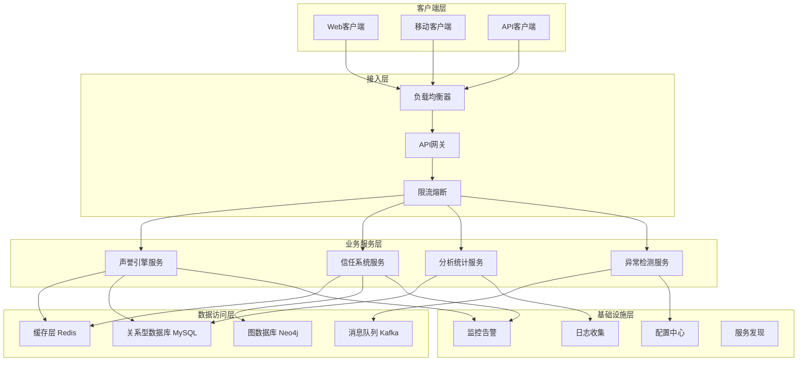
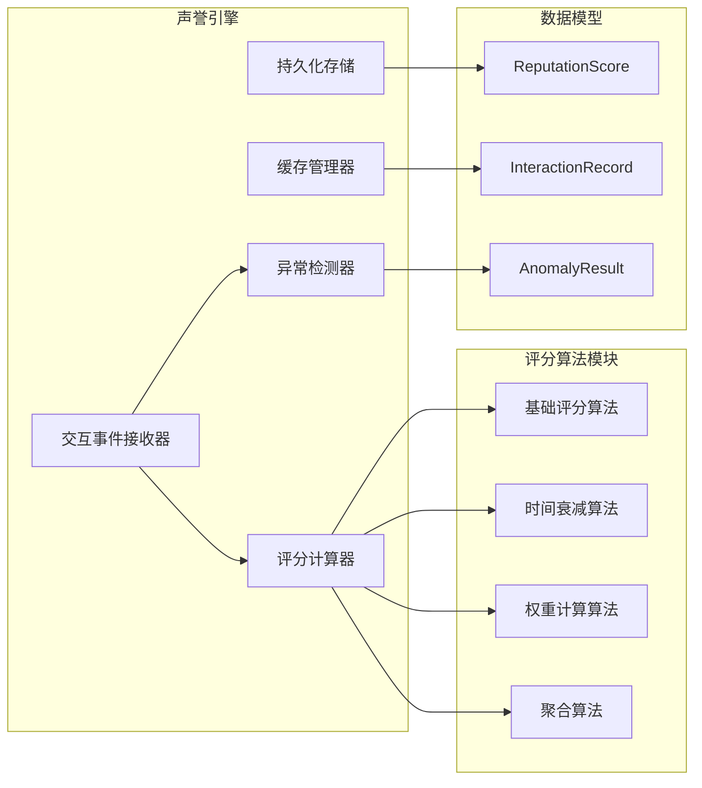
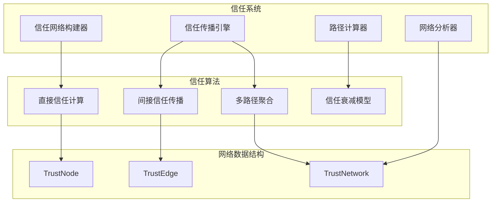
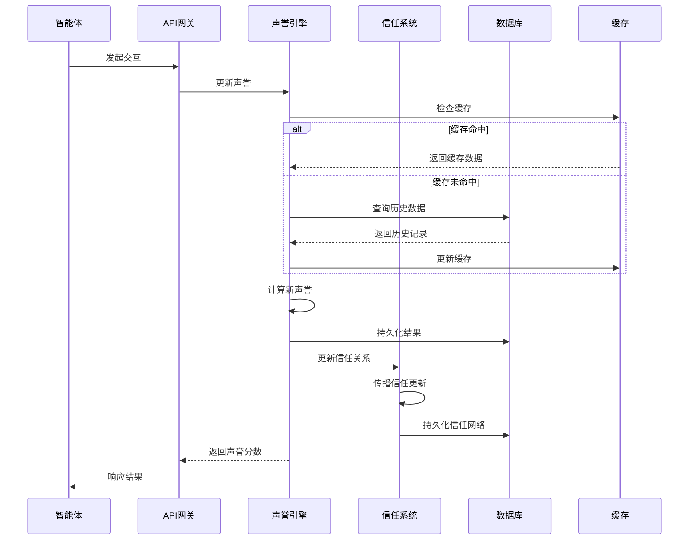
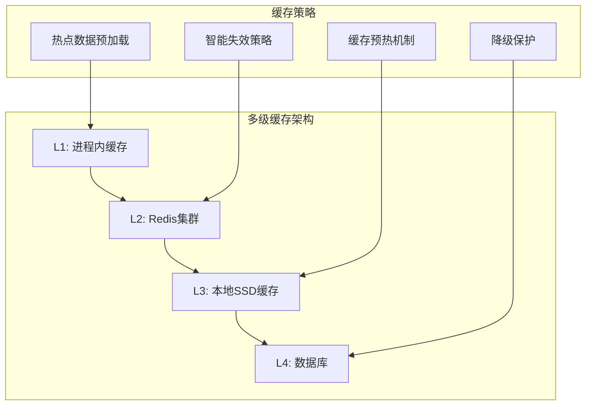
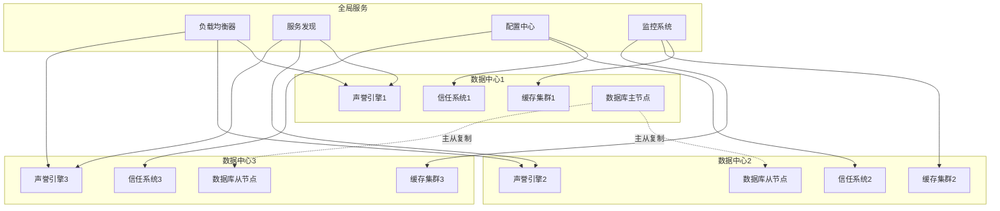
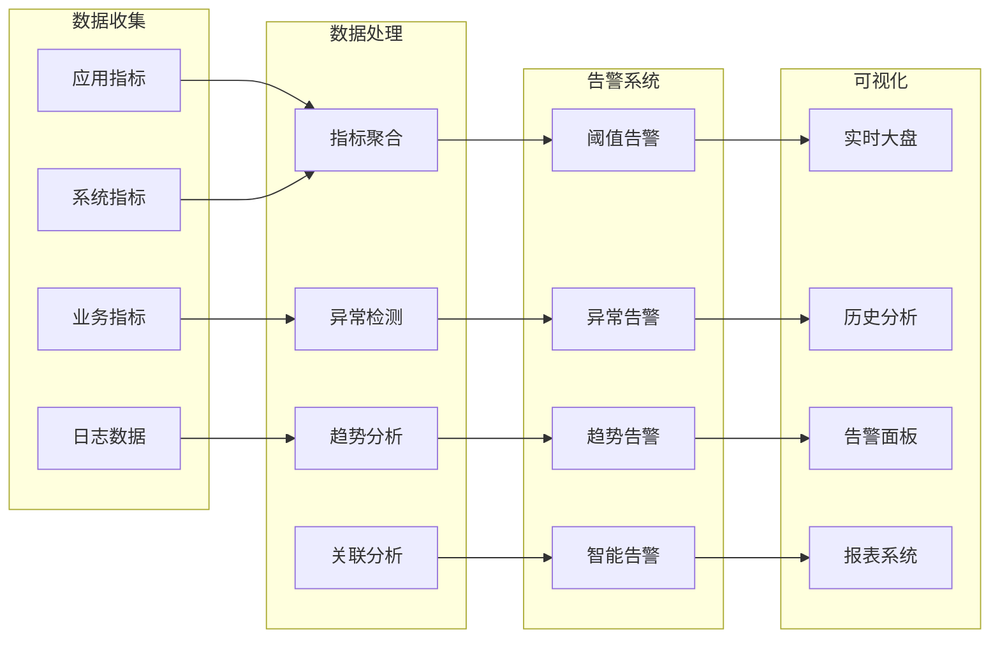
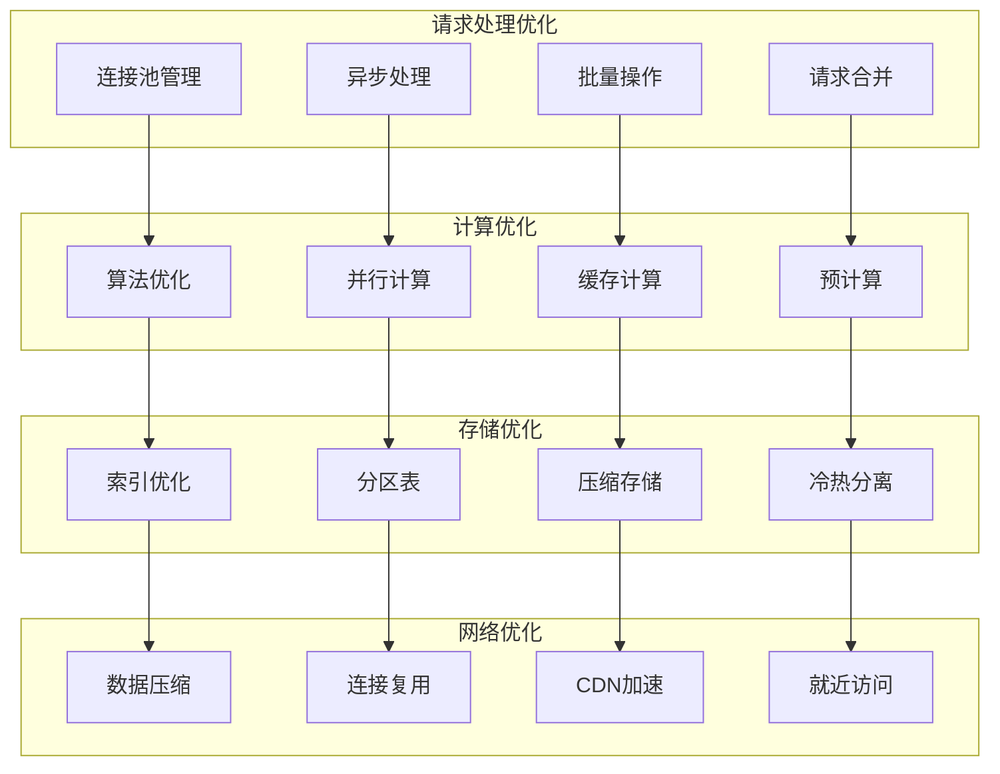
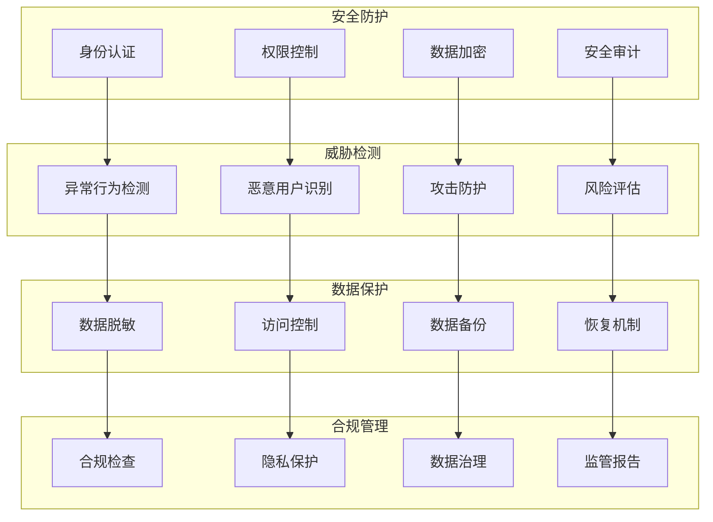
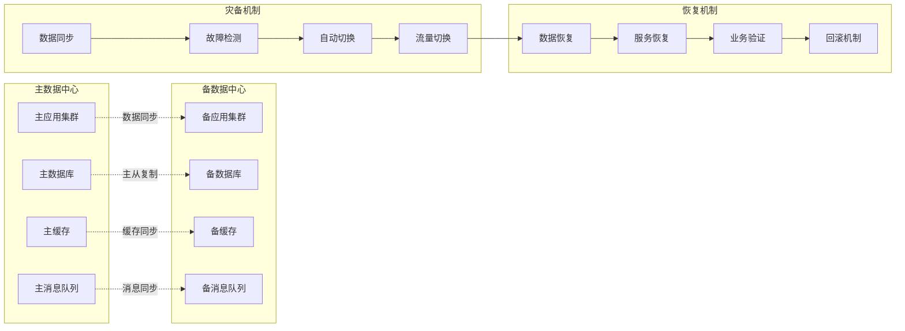

# 声誉引擎与信任系统架构图

## 1. 整体系统架构

## 2. 声誉引擎详细架构

## 3. 信任系统架构

## 4. 数据流架构

## 5. 缓存架构设计

## 6. 分布式部署架构

## 7. 监控告警架构

## 8. 性能优化架构

## 9. 安全架构

## 10. 灾备架构

这些架构图涵盖了声誉引擎和信任系统的各个方面，包括整体架构、详细设计、数据流、缓存策略、分布式部署、监控告警、性能优化、安全防护和灾备机制。每个架构图都使用Mermaid语法，可以在支持Mermaid的Markdown查看器中正常显示。